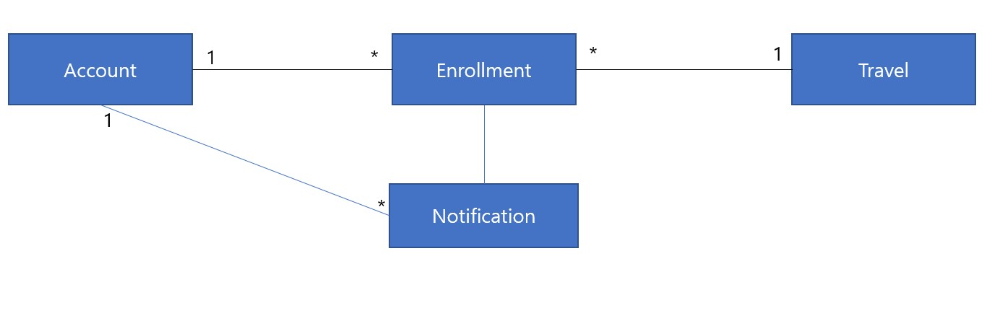
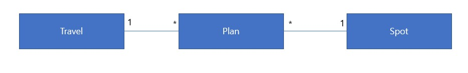

# With Travel Project

## 중점을 두고 개발할 부분

 - DB를 정규화해서 사용하기
 
 - 디버깅을 위한 나만의 방법

 - 추가할 기능 : 여행 경비 계산 및 분담 기능
 
 - 여행계획의 정렬! List를 이용한 시간순서 계획 
 - 여유가 더 있다면 계획들의 충돌 여부 확인

### 구현된 주요기능

 - 회원가입, 탈퇴, 회원관리기능, 세션을 이용한 로그인 유지기능
 - 여행생성, 가입, 탈퇴, 태그등록, 기본적인 관리 기능 제작

#### 모듈을 분리하기?

현재 제작중인 부분 Account에 JWT나 Oauth2.0을 적용 or 스프링 시큐리티?

 - 현재 진행중인 Travel 모듈에 대해서는 설정 수정작업이 어느정도 완료된 상태
 - 다음으로 해야할 부분은 Spot 모듈에 대해서는 만들고, 화이트리스트로 조회하고, 전체 조회할 수 있는 기능을 만들 예정
 - 그렇기 때문에 Spot에 Comment 기능과 대댓글 기능을 달아서 여행지에 대한 평을 올릴 수 있도록 할 예정
 - 목표 : 테스트 커버리지 70% 이상으로 향상할것. 현재 Travel관련한 테스트를 전부 삭제해버려서 전체 재작성 필요
 - Plan모듈에 주의를 기울일 필요가 있음 Spot 하나를 들고와서 관련된 여행내용을 작성해서 여행에 포함할 수 있는 엔티티
 - 1개 여행에 여러플랜이 대응되도록 제작할 예정, 

### TDD에서 배운 엔티티 설계 적용하기 
### 내가 이 프로젝트에서 독창적으로 손댈 수 있는 부분
 - 원작 프로젝트에서는 JPA로 레포지토리를 처리했지만, 이게 오히려 더 비효율적인것 같다. 직접 리포지토리를 만들어야겠다.
 - 원작 프로젝트에서는 없는 Spot 엔티티의 존재와 이 Spot을 이용해서 만들 수 있는 Plan 엔티티의 존재 
 - 그리고 이 Plan 엔티티를 소팅해서 유저들에게 일목요연하게 계획 제공
 - 그리고 예산을 짜고 이 예산을 유저들에게 N분의 1할 수 있는 기능
 - Spot 엔티티에서 카카오 지도 API 활용 
 - 계획 공유 플랫폼이 목적이다 보니, 다른 사람의 플랜을 그대로 베껴와서 여행을 만들 수 있는 기능
# 기본 설계(Account - Travel  중심의 그림)

# 설계 (Travel - Spot - Plan의 관계 정의)
